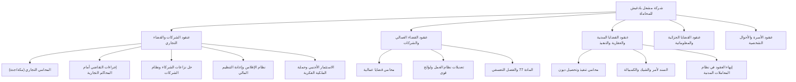

# خطة واستراتيجية بناء السلطة الرقمية لمحركات البحث (SEO Authority Roadmap)
## شركة مشعل بادغيش للمحاماة والاستشارات القانونية — مكة المكرمة وجدة

---

## 1. الملخص التنفيذي (Executive Summary)

تمثل هذه الوثيقة خارطة طريق استراتيجية قائمة على البيانات (Data-Driven Authority Roadmap) لبناء وتعزيز السلطة الرقمية والموضوعية (Topical & Entity Authority) لموقع **شركة مشعل بادغيش للمحاماة والاستشارات القانونية** (`https://mishal-lawfirm.com`).

تم إعداد هذه الاستراتيجية بناءً على إشارات الأداء الحقيقية في Google Search Console، والهيكل القائم للموقع، والمعايير التنظيمية الصارمة لقطاع المحاماة في المملكة العربية السعودية (وزارة العدل، الهيئة السعودية للمحامين، الأنظمة القضائية الحديثة).

### المبادئ الحاكمة لهذه الخطة:
1. **الأولوية للسلطة الموضوعية (Topical Authority) وليس حشو الكلمات المفتاحية:** الترتيب المستدام في الاستشارات القانونية لا يتحقق بتكرار العبارات، بل بالإجابة الشاملة والدقيقة على النوايا البحثية المركبة (Search Intent) للموكلين (شركات وأفراد).
2. **الاستقرار الفني والتجميد البرمجي (Strict Technical Freeze):** البنية البرمجية والـ SSR الحالية مستقرة ومعتمدة 100%. لا تعديلات برمجية أو إعادة هيكلة فنية في هذه المرحلة.
3. **التوثيق والتحقق المؤسسي (Entity Consistency):** مطابقة بيانات الكيان التجاري والقانوني عبر كافة القنوات الموثقة لمنع التشويش على خوارزميات الفهرسة والـ Knowledge Graph.
4. **التطوير المرحلي الخاضع للتقييم:** لا يتم تنفيذ أي مرحلة إلا بعد المراجعة والاعتماد.

---

## 2. الوضع الحالي للسلطة الرقمية (Current SEO Authority State)

### أ. البنية التحتية والجاهزية الفنية:
- **المعالجة والـ SSR:** الموقع يخدم 49 مساراً ثابتاً عبر المعالجة المسبقة (Static Pre-rendering) مع جسم HTML كامل وعناصر `<h1>` ومحتوى سيمانتك حقيقي.
- **مخطط الكيان (Schema.org @graph):** ربط احترافي بين كيانات `Organization` و `LegalService` و `Person` (المؤسس: مشعل بادغيش) و `WebSite`.
- **روابط التحقق الخارجي (`sameAs`):** ربط القنوات الرسمية الموثقة (LinkedIn, TikTok, Facebook).
- **ملفات التوجيه والفهرسة:** `sitemap.xml` محدث وديناميكي يضم 49 مساراً، و `robots.txt` نظامي وصحيح.

### ب. حدود الوصول لبيانات Google Search Console:
> [!NOTE]
> **إقرار منهجي:** الوصول المباشر الحي إلى واجهة برمجة تطبيقات GSC غير متاح داخل بيئة العمل البرمجية الحالية. وبناءً على ذلك، تم بناء هذه الاستراتيجية بالاعتماد على:
> 1. إشارات GSC الحقيقية المرصودة والمؤكدة في سجلات المشروع.
> 2. تحليل المحتوى والمسارات والخدمات القائمة في الكود المصدري.
> 3. تحليل مقاصد البحث ونوايا المستفيدين في سوق الخدمات القانونية بمنطقة مكة وجدة.

---

## 3. مصفوفة فرص Google Search Console (GSC Opportunity Matrix)

تم تصنيف الاستعلامات المرصودة وفق مصفوفة القرب من الفوز وقيمة الأعمال:

| الفئة (Category) | نطاق الترتيب | الاستعلامات المرصودة / الدلالية | نية البحث (Search Intent) | الرابط المستهدف الحالي | الفجوة الرئيسية |
| :--- | :--- | :--- | :--- | :--- | :--- |
| **A — مكاسب سريعة (Quick Wins)** | 4 – 10 | "حوكمة الشركات" "مكتب محاماة مكة" | معلوماتي/تجاري متقدم محلي تجاري (Local Intent) | `/articles/حل-نزاعات-الشركاء...` `/` (الصفحة الرئيسية) | فجوة ربط داخلي وتعميق نماذج اللوائح؛ توحيد بيانات الموقع الجغرافي. |
| **B — فرص الصفحة الأولى (Page One)** | 11 – 20 | "شركة محاماة مكة" | تجاري / توكيل مؤسسي | `/` أو `/about` | حاجة لتعزيز إشارات الترخيص المهني وإبراز نطاق الممارسة بمكة. |
| **C — فجوات السلطة (Authority Gaps)** | 21 – 50 | "محامي تجاري جدة" "محامي تجاري في جدة" | تجاري محلي متخصص (جدة) | `/commercial-lawyer-jeddah` `/commercial-lawyer-makkah` | فجوة محتوى مساند يركز على المحكمة التجارية بجدة والنزاعات الاستثمارية. |
| **D — غير مستهدف / منخفض الأولوية** | > 50 | عبارات استشارية عامة غير متوافقة نظامياً (مثل طلب صيغ غير مجازة) | غير محدد / نقرات غير مؤهلة | N/A | لا يتم إهدار ميزانية الزحف عليها. |

---

## 4. خطة المكاسب السريعة (Quick Wins — الفئة A)

### 1. استعلام: "حوكمة الشركات" (الترتيب الحالي التقريبي: 4.00)
- **نية البحث:** بحث إداري وقانوني تبحث فيه مجالس الإدارة والشركاء عن آليات ضبط الرقابة وصياغة لوائح الحوكمة وفق نظام الشركات الجديد.
- **الصفحة الحالية المنافسة:** مقالات نظام الشركات وحل نزاعات الشركاء.
- **إجراءات السلطة المقترحة:**
  - تدعيم المقال بروابط داخلية تشير إلى خدمة صياغة اللوائح الداخلية (`/quick-services/internal-regulations`) وعقود التأسيس.
  - إضافة قسم تنفيذي يربط حوكمة الشركات بمتطلبات وزارة التجارة ومنصة قوى.

### 2. استعلام: "مكتب محاماة مكة" (الترتيب الحالي التقريبي: 9.00)
- **نية البحث:** موكل محلي في مكة المكرمة يبحث عن مقر مرخص لتوكيل محامٍ في قضية أو استشارة فورية.
- **الصفحة الحالية المنافسة:** الصفحة الرئيسية (`/`).
- **إجراءات السلطة المقترحة:**
  - توضيح اختصاصات الترافع أمام المحكمة العامة والتجارية والعمالية بمكة المكرمة.
  - تعزيز الربط الداخلي من مقالات مكة إلى صفحة التواصل والخدمات الرئيسية.

---

## 5. فرص اقتحام الصفحة الأولى (Page-One Opportunities — الفئة B)

### استعلام: "شركة محاماة مكة" (الترتيب الحالي التقريبي: 11.50)
- **تحليل الفجوة:** الترتيب في أول الصفحة الثانية يعني أن جوجل يتعرف على الموقع ككيان مهني بمكة، لكنه يقدم منافسين يمتلكون إشارات ثقة وربط أوضح حول الصفة المؤسسية للشركة (Professional Law Corporation).
- **خطة الصعود إلى المراكز الخمسة الأولى:**
  - إبراز معايير الترخيص المهني عبر بوابة ناجز لوزارة العدل ككيان شركة محاماة وليس مجرد وسيط.
  - تدعيم الروابط الداخلية القادمة من مقالات دليل التوكيل والقضايا في مكة لتشير بسياق دلالي طبيعي إلى صفحة "من نحن" والصفحة الرئيسية.

---

## 6. معالجة فجوات السلطة التخصصية (Authority Gaps — الفئة C)

### استعلامات: "محامي تجاري جدة" / "محامي تجاري في جدة" (الترتيب التقريبي: 34 – 37)
- **التشخيص الدقيق:** لماذا يقف الترتيب في الثلاثينات رغم وجود صفحة `/commercial-lawyer-jeddah`؟
  - ❌ **ليس بسبب نقص الكلمة المفتاحية:** حشو كلمة "جدة" لن يجدي نفعاً بل قد يضر.
  - ✅ **السبب الحقيقي:** نقص "السلطة الموضوعية للمحاكم التجارية بمحافظة جدة"؛ محرك البحث يحتاج إلى إثبات أن الشركة تفهم بيئة الأعمال ومحكمة الاستئناف والدوائر التجارية بجدة عبر مقالات تخصصية مساندة (مثل إجراءات التقاضي التجاري، وتأسيس الاستثمار الأجنبي في ميناء ومطار جدة، ونزاعات التوريد والشركات).
- **الحل:** بناء عنقود موضوعي تجاري (Commercial Law Topic Cluster) يغذي صفحات خدمات جدة ومكة بالروابط والسلطة المعرفية.

---

## 7. خارطة السلطة الموضوعية والعناقيد (Topical Authority Map)

تم تنظيم كافة خدمات الموقع الحقيقية ضمن 5 عناقيد موضوعية كبرى (Topic Clusters):

### العناقيد التفصيلية القائمة:
1. **عنقود الشركات والنزاعات الاستثمارية (Corporate & Commercial Pillar):**
   - *صفحات الهبوط الرئيسية:* `/commercial-lawyer-makkah`، `/commercial-lawyer-jeddah`، `/quick-services/commercial-consultation`.
   - *المحتوى المساند القائم:* مقالات نظام الشركات الجديد، نظام الإفلاس، التحول الرقمي، الاستثمار الأجنبي، الملكية الفكرية.
2. **عنقود العمل ولوائح المنشآت (Labor & Employment Pillar):**
   - *صفحات الهبوط الرئيسية:* `/labor-lawyer-makkah`، `/labor-lawyer-jeddah`، `/quick-services/internal-regulations`، `/quick-services/labor-consultation`.
   - *المحتوى المساند القائم:* مقالات تعديلات نظام العمل، المادة 77، لوائح تنظيم العمل عبر قوى.
3. **عنقود المعاملات المدنية والتنفيذ (Civil, Debt & Execution Pillar):**
   - *صفحات الهبوط الرئيسية:* `/debt-collection-makkah`، `/judgment-execution-jeddah`، `/contract-drafting-makkah`، `/quick-services/execution-requests`.
   - *المحتوى المساند القائم:* السند لأمر والأوراق التجارية، نظام المعاملات المدنية الجديد.
4. **عنقود القضايا الجزائية والعسكرية (Criminal & Military Pillar):**
   - *صفحات الهبوط الرئيسية:* `/criminal-lawyer-makkah`، `/criminal-lawyer-jeddah`، `/military-cases-makkah`.
   - *المحتوى المساند القائم:* مقال الحق الخاص والحق العام في القضايا الجزائية.
5. **عنقود الأحوال الشخصية والتركات (Family & Estates Pillar):**
   - *صفحات الهبوط الرئيسية:* `/family-lawyer-makkah`، `/family-lawyer-jeddah`، `/quick-services/family-consultation`.

---

## 8. تدقيق السلطة المحلية (Local SEO Authority Audit)

### أ. تنبيه تدقيق العنوان الجغرافي (Data Verification Issue):
> [!IMPORTANT]
> **مسألة تضارب عنوان المقر المكتبي:**
> - **بيانات Google Business Profile:** `حي ولي العهد، مكة 24353، السعودية`
> - **تذييل الموقع والمخطط البرمجي:** `شارع عبدالله بن عباس - بجوار نادي ستار تراك - مكة المكرمة`
> 
> **التوصية:** لا يجوز التغيير الآلي أو التخمين برمجياً. تم رفع هذا البند للمراجعة البشرية لاعتماد العنوان الرسمي المرخص لدى وزارة العدل وتوحيده مستقبلاً في ملف Google Business ومخطط الموقع.

### ب. الفصل الواضح بين المقر الفيزيائي ونطاق الخدمة:
- **المقر الفعلي الفيزيائي (Physical Office):** مكة المكرمة فقط.
- **نطاقات التغطية والتمثيل المعتمدة (Service Area):** مكة المكرمة، جدة، ومنطقة مكة الإدارية.
- يمنع إنشاء صفحات جغرافية لمدن وهمية لا توجد فيها خدمات حقيقية تجنباً لعقوبات Doorway Pages.

---

## 9. تدقيق سلطة الكيان (Entity Authority Audit)

| عنصر الكيان | الحالة الراهنة في الكود | التقييم والتوصية |
| :--- | :--- | :--- |
| **اسم الكيان المؤسسي** | شركة مشعل بادغيش للمحاماة والاستشارات القانونية | مطابق وثابت في `siteSchema.ts` والوسوم الوصفية |
| **المؤسس (Founder Entity)** | مشعل بادغيش (`Person` Schema) | مسجل كمحامٍ ومستشار مرخص مع ربطه بمقالات الرأي |
| **نطاق المعرفة (knowsAbout)** | الأنظمة القضائية، المعاملات المدنية، نظام الشركات، قوى، ناجز | معرفة تخصصية تغطي الأنظمة السعودية الحاكمة |
| **ملفات التواصل الموثقة (sameAs)** | LinkedIn, TikTok, Facebook الرسمية | مفحوصة ومربوطة في الـ Graph الموحد |
| **رقم الهاتف والاتصال** | `+966568000085` / `info@mishal-lawfirm.com` | موحد ومستخدم في كافة مسارات التواصل والـ Schema |

---

## 10. خارطة تدفق السلطة والربط الداخلي (Internal Link Authority Map)

### القواعد الإرشادية لشبكة الروابط الداخلية:
1. **توجيه القوة من المقالات إلى صفحات الخدمات (Bottom-Up Flow):**
   كل مقال يركز على موضوع تخصصي يجب أن يحتوي على رابط سياقي طبيعي (Contextual Anchor) يشير إلى صفحة الخدمة المعنية وإلى وسيلة التواصل.
2. **الربط بين المقالات المتقاربة في نفس العنقود (Peer-to-Peer Cluster Linking):**
   مثل ربط مقال "نظام الشركات الجديد" بمقال "حل نزاعات الشركاء" ومقال "نظام الإفلاس".
3. **تجنب تكرار النصوص الحرفية المفرطة (Avoid Exact-Match Anchor Stuffing):**
   استخدام عبارات تدل على القيمة للمستفيد مثل: `[استشارة محامي تجاري مرخص في مكة]`، `[خدمات الترافع أمام الدوائر التجارية]`، `[دليل إجراءات منصة قوى]`.

---

## 11. تحليل فجوات المحتوى (Content Gap Analysis)

### ما يجب تعزيزه في المحتوى القائم (Existing Content Expansion):
- إضافة أسئلة شائعة متعمقة (FAQs) مبنية على أحكام الأنظمة الجديدة في صفحات خدمات جدة ومكة التجارية والعمالية.
- إثراء مقالات القضايا العمالية بالأحكام القضائية المستقرة حول الفصل غير المشروع واحتساب مكافأة نهاية الخدمة.

### معايير استحداث أي محتوى جديد مستقبلاً:
- ✅ **مقبول:** مقال يجيب على استفسار إجرائي حقيقي للموكلين وله بحث فعلي في مكة/جدة.
- ❌ **مرفوض قطعاً:** مقالات عامة مترجمة، أو مقالات لا ترتبط بالنظام القضائي السعودي، أو مقالات منسوخة ومفرغة المحتوى.

---

## 12. استراتيجية السلطة الخارجية (Off-Page Authority Strategy)

التركيز على بناء إشارات ثقة طبيعية ونظامية لا تنتهك معايير جوجل ولا أنظمة مهنة المحاماة:
1. **الأدلة القانونية والمهنية الرسمية:** التحقق من إدراج الكيان في الأدلة المهنية السعودية المعتمدة ودليل الأعمال المحلي بمكة.
2. **المشاركات المعرفية والمقالات التحليلية:** نشر دراسات وتحليلات للأنظمة المستحدثة في المنصات الاقتصادية والقانونية الرصينة مع ذكر اسم الشركة والمؤسس كمصدر رسمي.
3. **التوثيق الرقمي والملفات الاجتماعية:** تعزيز التفاعل المهني على LinkedIn ووسائل التواصل المعتمدة لبناء إشارات الكيان الرقمي الحقيقي (Entity Signals).

---

## 13. مصفوفة الأولويات (Priority Matrix)

تم تقييم الفرص بناءً على الأثر، والقرب من الفوز، والجهد المطلوب (مقياس من 1 إلى 100):

| الرمز | المبادرة / الفرصة | الدرجة (1-100) | التصنيف | العائد المتوقع على السلطة |
| :--- | :--- | :--- | :--- | :--- |
| **OPT-01** | تعزيز شبكة الربط الداخلي السياقي من مقالات الشركات إلى الخدمات التجارية | 94 | **P0 (فوري)** | تثبيت صدارة "حوكمة الشركات" والصعود بـ "محامي تجاري جدة" |
| **OPT-02** | تدقيق وتوثيق العنوان الجغرافي الموحد (NAP Verification) مع الإدارة | 91 | **P0 (فوري)** | إنهاء تضارب الإشارات المحلية لـ "شركة محاماة مكة" |
| **OPT-03** | إثراء صفحات خدمات جدة ومكة التجارية بإجراءات التقاضي المحلية الحقيقية | 86 | **P1 (عالي)** | نقل استعلامات "محامي تجاري جدة" من الصفحة 4 إلى الصفحة 2 |
| **OPT-04** | تعزيز عنقود قضايا العمل والمنشآت بروابط داخلية تشير إلى لوائح تنظيم العمل | 82 | **P1 (عالي)** | التقاط نوايا بحث مدراء الموارد البشرية والشركات |
| **OPT-05** | بناء مصفوفة أسئلة شائعة إجرائية (Procedural FAQs) في صفحات الخدمات | 78 | **P2 (متوسط)** | الاستحواذ على مقتطفات الذكاء الاصطناعي (AEO/GEO Signals) |

---

## 14. خارطة طريق 30 يوماً (Phase 1: 30-Day Roadmap)

### الأهداف الأساسية:
- حصد المكاسب السريعة (Quick Wins) للاستعلامات الواقعة بين المراتب 4 و10.
- التحقق النهائي من اتساق بيانات الكيان والمقر الجغرافي (NAP Consistency).
- تحسين تدفق الروابط الداخلية بين المسارات القائمة الـ 49 دون أي تغيير في البنية البرمجية.

### الإجراءات المحددة:
1. اعتماد العنوان الجغرافي الرسمي مع إدارة الشركة وحل تضارب الـ Google Business Profile.
2. تعزيز الربط الداخلي من مقالات "حوكمة الشركات" و"حل نزاعات الشركاء" إلى صفحة الخدمة التجارية وخدمات الصياغة.
3. تدقيق عناوين الـ H2 والفقرات الدلالية في صفحات `/commercial-lawyer-makkah` و `/commercial-lawyer-jeddah` لتغطية الاختصاص النوعي للمحاكم التجارية بوضوح تام.

---

## 15. خارطة طريق 60 يوماً (Phase 2: 60-Day Roadmap)

### الأهداف الأساسية:
- دفع استعلامات الصفحة الثانية (11-20) لاقتحام المراكز الخمسة الأولى في مكة المكرمة.
- تقليص فجوة السلطة في استعلامات جدة التجارية (النزول من 30+ إلى 15 فما دون).
- بناء الترابط العميق بين العناقيد الموضوعية الفرعية.

### الإجراءات المحددة:
1. إثراء العناقيد التجارية والعمالية بدراسات حالات نظامية مجردة ونماذج توعوية لإجراءات ناجز وقوى.
2. تدعيم الربط بين خدمات التنفيذ وتحصيل الديون وصفحات الخدمات التجارية.
3. تعزيز إشارات الثقة الاجتماعية (LinkedIn Company Updates) لربط الكيان بالمواضيع النظامية الحية.

---

## 16. خارطة طريق 90 يوماً (Phase 3: 90-Day Roadmap)

### الأهداف الأساسية:
- ترسيخ الهيمنة على استعلامات الكيان والشركات في منطقة مكة المكرمة.
- الظهور في الإجابات المباشرة لمحركات الذكاء الاصطناعي (AEO / GEO Optimization).
- تحليل عوائد التحويل الفعلي (Conversion Rate & Consultation Inquiries).

### الإجراءات المحددة:
1. تحليل حركة الزيارات ونمو النقرات عبر GSC وتحديد الاستعلامات الصاعدة الجديدة.
2. تحسين معدلات النقر (CTR Optimization) عبر تحسين صياغة عناوين الـ Meta والـ Snippets للمسارات الأعلى ظهوراً.
3. مراجعة شاملة لعمق الإجابات وتحديث الإحالات النظامية في حال صدور أي تعديلات تشريعية سعودية جديدة.

---

## 17. مؤشرات الأداء الرئيسية (KPI Framework)

| المؤشر (KPI) | خط الأساس الحالي (Baseline) | الهدف بعد 60 يوماً | الهدف بعد 90 يوماً |
| :--- | :--- | :--- | :--- |
| **ترتيب استعلام "حوكمة الشركات"** | ~ 4.00 | المراكز 1 – 3 | المركز 1 – 2 |
| **ترتيب استعلام "مكتب محاماة مكة"** | ~ 9.00 | المراكز 3 – 5 | المراكز 1 – 3 |
| **ترتيب استعلام "شركة محاماة مكة"** | ~ 11.50 | المراكز 4 – 7 | المراكز 2 – 5 |
| **ترتيب استعلام "محامي تجاري جدة"** | ~ 34.17 | المراكز 12 – 18 | المراكز 6 – 10 |
| **إجمالي المسارات المفهرسة والمؤهلة** | 49 مساراً ثابتاً | 49 مساراً ثابتاً | تغطية كاملة ومستقرة |
| **أخطاء الزحف والـ Soft 404** | 0 أخطاء | 0 أخطاء | 0 أخطاء |

---

## 18. المحاذير والأعمال الممنوعة (Risks & Things NOT To Do)

> [!CAUTION]
> تجنب هذه الممارسات منعاً لأي تراجع في التصنيف أو عقوبات خوارزمية:
> 1. **حظر حشو الكلمات المفتاحية (No Keyword Stuffing):** يمنع تكرار أسماء المدن أو التخصصات بشكل قسري داخل النصوص.
> 2. **حظر إنشاء صفحات وهمية للمدن (No Doorway Pages):** يمنع استحداث صفحات لمدن لا تمتلك الشركة فيها تمثيلاً حقيقياً.
> 3. **حظر شراء الروابط الخلفية الوهمية (No Toxic PBNs/Backlinks):** الاعتماد فقط على الإشارات الطبيعية والتوثيق المعتمد.
> 4. **حظر كسر الاستقرار البرمجي:** لا تعديل في منطق الـ SSR أو ملفات الـ build أو القوالب دون مراجعة معتمدة ومفصولة.
> 5. **حظر اختلاق بيانات أو تراخيص أو اعتمادات غير حقيقية.**

---

## 19. الترتيب الدقيق للتنفيذ (Exact Implementation Order)

1. **الخطوة 1:** مراجعة واعتماد هذه الاستراتيجية وتثبيت العنوان الجغرافي الرسمي للشركة.
2. **الخطوة 2:** تطبيق استراتيجية الربط الداخلي الدلالي للمكاسب السريعة (Quick Wins).
3. **الخطوة 3:** إثراء محتوى الخدمات التجارية القائمة (مكة وجدة) بالأبعاد الإجرائية الحقيقية.
4. **الخطوة 4:** مراقبة وتقييم مؤشرات الأداء وحركة الكلمات عبر GSC دورياً بعد كل مرحلة.

---
**حالة الوثيقة:** مُنفَّذة المرحلة الأولى (Phase 1 — Branch v9).

### تغييرات v9 المُنفَّذة (Phase 1 — Internal Authority & Technical Hardening):
1. **`components/Footer.tsx`**: توسيع شبكة الروابط الداخلية لتشمل جميع صفحات الخدمات الـ 13 (مكة وجدة) — معالجة الصفحات اليتيمة: `/family-lawyer-jeddah`، `/judgment-execution-jeddah`، `/contract-drafting-makkah`، `/litigation-services-makkah`، `/debt-collection-makkah`.
2. **`components/SEO.tsx`**: إضافة وسم `og:image:alt` (امتثال بروتوكول Open Graph وإمكانية الوصول).
3. **`data/siteSchema.ts`**: إضافة `potentialAction` (SearchAction) لكيان WebSite لتفعيل إشارة Sitelinks Search Box.
4. **`public/sitemap.xml`**: تم التحديث التلقائي عبر سكريبت التوليد الثابت — **54 رابطاً مُحققاً** (26 مقالة + 13 خدمة + 8 صفحات ثابتة + 7 خدمات سريعة).

### الخطوات المقبلة (Phase 2):
- OPT-03: إثراء صفحات `/commercial-lawyer-jeddah` و`/commercial-lawyer-makkah` بمحتوى إجرائي محلي.
- OPT-05: تعزيز FAQs في صفحات الخدمات المستهدفة.
- مراقبة أداء GSC بعد دمج v9 في main.
